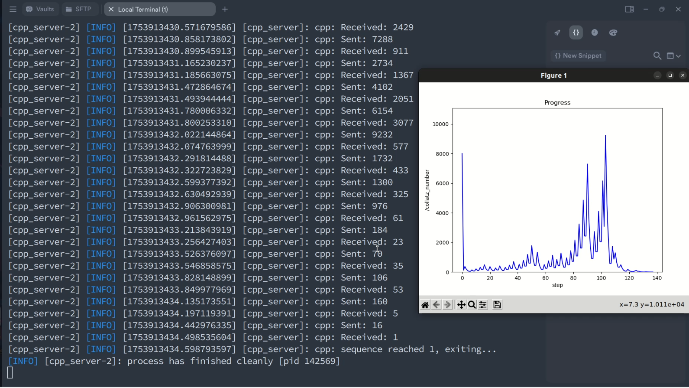

## About the task:
- this project is defined as a ROS2 system prototype which is able to send data over network without using ROS2 middleware(DDS)'s `pub & sub communication`. 
- while this project is a didactic task from `auriga robotics team` and no further implementation is planned at the moment, it offers a good simple setup to get started with when trying to avoid DDS for any reason.
- a use case scenario: imagine you're developing a `warehouse robot` operating real-time on a ROS2 system. at some point, it needs to exchange data with a backend server(e.g. querying a database to check item availability), and most non-ROS systems don’t natively support DDS, as DDS is primarily designed for real-time distributed communication within robotic or embedded systems. In such cases, using standard TCP/UDP sockets provides a practical alternative for data exchange over local or public networks.

## System's flow
in this project, two cpp & python nodes exchange a `serialized data` using `tcp socket`. the `data` is a `ROS message` and while its a int64 here, the system is desinged for `any complex ROS message` since we serialize and deserialize the data on the endpoints of server & client's sides accourdingly.


the designed system is exchanging collatz conjecture sequnce numbers:

1. both nodes gets started on seperate machines across the same local network while cpp node gets a parameter as the starting number

2. cpp node waits for python node to get started and send a starting flag to cpp node

3. when cpp node receives the flag, it enters the collatz loop with the starting number

4. cpp loop: if number's odd, triples the number and adds one, then sends the new even number to python node, then waits for a new odd number from python node to do the process again. breaks the loop when receives 1.

5. python loop: if number's even, divides it by 2 until its odd, then sends the new odd number to cpp node, then waits for a new even number from cpp node to do the process again. after dividing, when it reaches 1, sends the 1 to cpp for one last time and breaks the loop

> note: the system is not using ros spin and repetation is handled with some simple loops plus send and receive methods defined in program

## Launching the program

0. clone the project on machine A's home directory($HOME) and make scripts executable:
- ```git clone https://github.com/AmirrezaRamesh/ros2-socketcomm```
- ```chmod +x ros2-socketcomm/build.sh ros2-socket-comm/launch.sh```

1. build the project: ```./build.sh 192.168.X.X remote_user```
- the script receives `192.168.X.X` and `remote_user` as the IP and user name of machine B
- the script uses scp to send python & core packge to machine B
- the script builds packages on both machines
- the script adds source commands to bashrc 


2. launch the project: ```./launch.sh 8000 192.168.X.X 192.168.X.Y remote_user```
- the script receives 4 parameter for starting number, first IP for machine A and second IP for machine B and user of machine B
- the script launches a launch file on machine A for cpp node and visualizer
- the script uses ssh to connect to machine B
- the script creates a tmux session on machine B 
- the script runs the node inside the tmux session on machine B

> note: ssh and scp is used in scripts above, every single time, you have to enter the remote user's password. to avoid that, use the command below to add your ssh public key to authroized keys of the machine B using: `ssh-copy-id remote_user@remote_IP`. but before that, make sure openssh-server and openssh-client are installed and you have a ssh public key.to create a ssh public key, use `ssh-keygen -t rsa`

### running the program
click on the picture and download the mp4 file if you'd like to see a run of the program

[](docs/run.mp4)

### extra_details

- between choosing udp and tcp: in real-time services, it's more common to use udp as its faster yet more unreliable but the loss of data once in a while is more favourable than adding delay to service. however in many applications that use udp as transport method, they add more flexbility for handling lossy networks. for example DDS uses QoS policies to let the developer handle the data. reliability, durability and depth are part of these policies. for instance, if u set actuator command's reliability to `RELIABLE` the DDS makes sure the udp packet is received and retrying if not. this is a very good practice since we have both speed and reliability for this important data. however a data like laser scanner is fine to be lost every once in a while. but in this project since we didn't want to lose any data along the way, and didn't have the skills to develop a reliability profile for udp packets, I chose to use tcp sockets

- `rqt_graph` is not developed for ros2 but as an alternative, `plot juggler` ,which is a powerful visualizing tool, has plugins for ros2(humble), but no matter how much I tried to install it (using apt, building sources, snap and etc) I couldn't get the program working so I had to write a simple matplotlib program to read the topic and visualize the data. for sure this wasn't the prettiest plot , it was a minimal way out of it after all.

- the annoying challenge I had, was for the communication timing. the nodes initialzation, port listening and sending data was way off in terms of synchronization. to handle the timing, I added some retrying logics, a starting flag and some error logs and finally was able to get things done smoothly

- the other challenge I faced, was combining ros commands with a shell script and ssh sessions. I was facing errors that didn't make sense. for example in ssh execution for python node on remote PC, `source bashrc`couldn't make colcon build enviroment setup in time and would crash the process but sourcing ros and workspace after each other worked just fine! when running commands in an script, you either have to run them in background, or let them finish so that the next command is run. meaning if you run the cpp node on machine A first, it wouldn't get to ssh execution later. so I ran the cpp node after sending the ssh command for python node and that made the timing a bit tricky but I added a small delay and fixed it.

- rclcpp serialization:`rclcpp::Serialization<message_type>` is a ros2 class used to serialize and deserialize ros2 messages and  `rclcpp::SerializedMessage` is a buffer to hold the serialized data.

- rclpy serialization: `rcply.serialization` is a module with two function that return serialized and deserialzed form of ros2 messages

- TODO: I really wanted to test this program on docker containers instead of physical machines as a fun practice, and I might as well do it in a couple of days 
